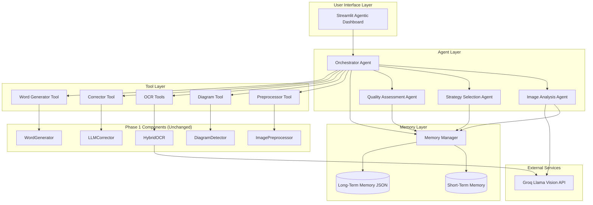
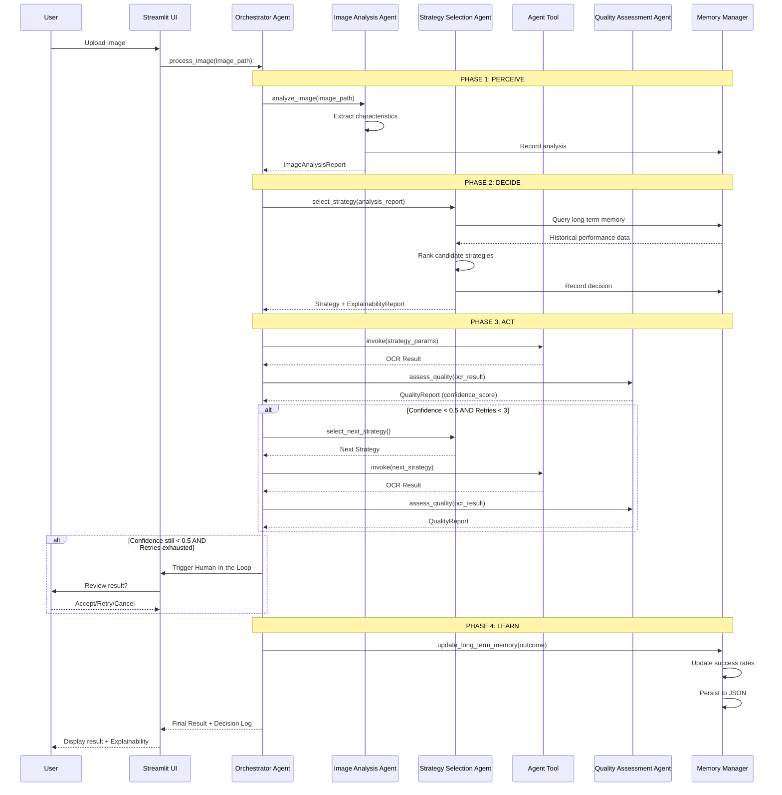
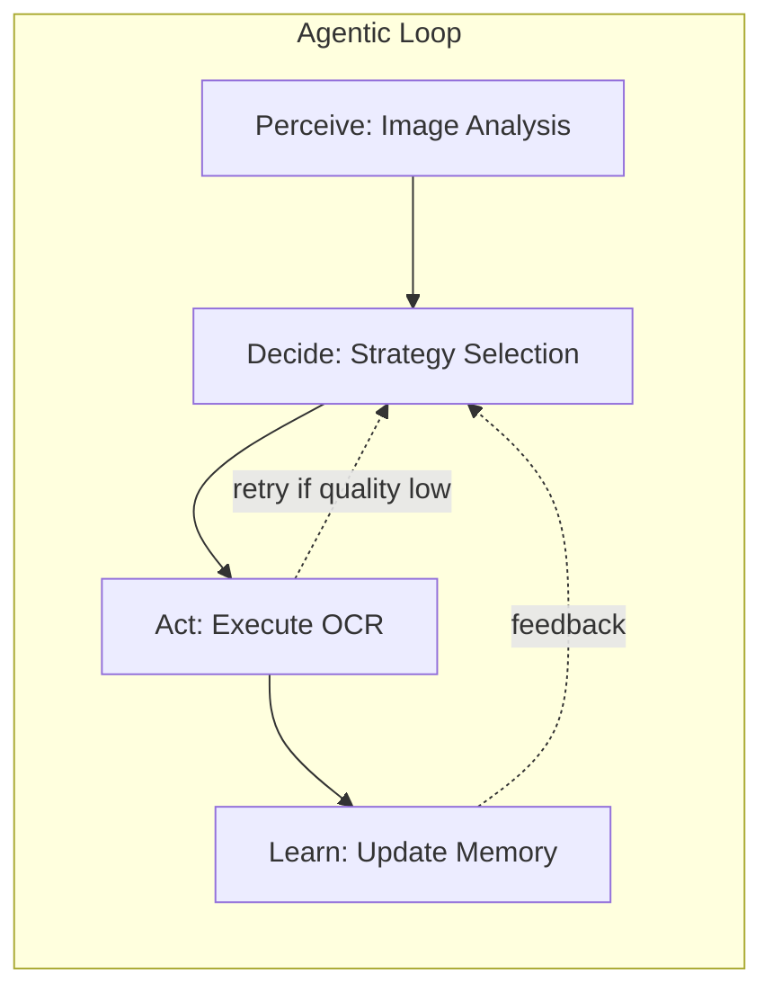

# Design Document: Agentic OCR Pipeline

## Overview

The **Agentic OCR Pipeline** transforms the existing Phase 1 "Handwriting to Word Converter" from a static, sequential pipeline into a Purely Agentic System. The system implements a complete Perceive → Decide → Act → Learn loop, where autonomous agents analyze images, select optimal OCR strategies, evaluate output quality, recover from errors, and continuously improve through historical performance data.

### Key Design Principles

1. **Autonomy**: Agents make decisions without user intervention within defined safety boundaries
2. **Transparency**: All decisions are logged and explained in human-readable format
3. **Safety**: Human-in-the-loop controls and override mechanisms prevent runaway automation
4. **Learning**: System improves over time through persistent memory of strategy performance
5. **Graceful Degradation**: System remains functional even when components fail
6. **Modularity**: Phase 1 components are wrapped as tools, preserving backward compatibility

### System Context

The system operates in a university course context (Professional Practices in IT) and must demonstrate:
- Complete agentic loop implementation (Perceive → Decide → Act → Learn)
- Ethical AI design (ACM/IEEE Code of Ethics compliance)
- Privacy by design (GDPR-inspired principles)
- Legal awareness (PECA 2016 compliance)
- Professional software engineering practices

---

## Architecture

### High-Level System Architecture



### Agentic Loop Data Flow



### Component Interaction Diagram



---

## Components and Interfaces

### Base Agent Abstract Class

**File**: `src/agents/base_agent.py`

```python
from abc import ABC, abstractmethod
from typing import Dict, Any, Optional
from datetime import datetime
import logging

class BaseAgent(ABC):
    """
    Abstract base class for all agents in the agentic system.
    
    Provides common functionality:
    - Logging
    - Error handling
    - Memory access
    - Decision recording
    """
    
    def __init__(self, name: str, memory_manager: 'MemoryManager'):
        self.name = name
        self.memory_manager = memory_manager
        self.logger = logging.getLogger(f"agent.{name}")
    
    @abstractmethod
    def execute(self, inputs: Dict[str, Any]) -> Dict[str, Any]:
        """
        Main execution method that each agent must implement.
        
        Args:
            inputs: Agent-specific input dictionary
            
        Returns:
            Agent-specific output dictionary with at minimum:
            - status: "success" or "error"
            - output: The agent's result
            - execution_time_seconds: float
        """
        pass
    
    def log_decision(self, decision_type: str, inputs: Dict[str, Any], 
                     output: Dict[str, Any], rationale: str) -> None:
        """Record a decision to the decision log via memory manager."""
        decision_entry = {
            "agent": self.name,
            "decision_type": decision_type,
            "timestamp": datetime.now().isoformat(),
            "inputs": inputs,
            "output": output,
            "rationale": rationale
        }
        self.memory_manager.record_decision(decision_entry)
    
    def handle_error(self, error: Exception, context: Dict[str, Any]) -> Dict[str, Any]:
        """
        Standard error handling for all agents.
        
        Returns error result dict instead of raising.
        """
        self.logger.error(f"{self.name} error: {error}", exc_info=True)
        return {
            "status": "error",
            "error_message": str(error),
            "error_type": type(error).__name__,
            "context": context,
            "execution_time_seconds": 0.0
        }
```

---

### Orchestrator Agent

**File**: `src/agents/orchestrator_agent.py`

```python
from typing import Dict, Any, List, Optional
import time
from .base_agent import BaseAgent
from .image_analysis_agent import ImageAnalysisAgent
from .strategy_agent import StrategySelectionAgent
from .quality_agent import QualityAssessmentAgent
from .memory_manager import MemoryManager
from .tools.base_tool import AgentTool

class OrchestratorAgent(BaseAgent):
    """
    Central coordinator that manages the full Perceive→Decide→Act→Learn loop.
    
    Responsibilities:
    - Coordinate all other agents
    - Manage retry logic (max 3 retries)
    - Trigger human-in-the-loop when needed
    - Ensure all phases execute in order
    """
    
    RETRY_BUDGET = 3
    MIN_ACCEPTABLE_CONFIDENCE = 0.5
    
    def __init__(self, memory_manager: MemoryManager, tools: Dict[str, AgentTool]):
        super().__init__("orchestrator", memory_manager)
        self.tools = tools
        
        # Initialize sub-agents
        self.image_analysis_agent = ImageAnalysisAgent(memory_manager)
        self.strategy_agent = StrategySelectionAgent(memory_manager)
        self.quality_agent = QualityAssessmentAgent(memory_manager)
    
    def execute(self, inputs: Dict[str, Any]) -> Dict[str, Any]:
        """
        Execute the full agentic loop for an image.
        
        Args:
            inputs: {
                "image_path": str,
                "session_id": str,
                "user_override": Optional[Dict]  # Manual strategy override
            }
            
        Returns: {
            "status": "success" | "error",
            "final_result": OCR result dict,
            "confidence_score": float,
            "retry_count": int,
            "phases_completed": List[str],
            "decision_log": List[Dict],
            "explainability_report": str,
            "hitl_triggered": bool
        }
        """
        start_time = time.time()
        image_path = inputs["image_path"]
        session_id = inputs["session_id"]
        user_override = inputs.get("user_override")
        
        phases_completed = []
        retry_count = 0
        hitl_triggered = False
        
        try:
            # Initialize session memory
            self.memory_manager.start_session(session_id, image_path)
            
            # PHASE 1: PERCEIVE
            self.logger.info(f"[{session_id}] PHASE 1: PERCEIVE")
            analysis_result = self.image_analysis_agent.execute({"image_path": image_path})
            
            if analysis_result["status"] == "error":
                return self._build_error_result("Perception phase failed", analysis_result)
            
            analysis_report = analysis_result["output"]
            phases_completed.append("perceive")
            
            # PHASE 2: DECIDE
            self.logger.info(f"[{session_id}] PHASE 2: DECIDE")
            
            if user_override:
                # User manually specified strategy
                strategy = user_override
                explainability = "User manually overrode strategy selection"
                candidate_strategies = [strategy]
            else:
                # Agent selects strategy
                strategy_result = self.strategy_agent.execute({
                    "analysis_report": analysis_report,
                    "session_id": session_id
                })
                
                if strategy_result["status"] == "error":
                    return self._build_error_result("Decision phase failed", strategy_result)
                
                strategy = strategy_result["output"]["selected_strategy"]
                explainability = strategy_result["output"]["explainability_report"]
                candidate_strategies = strategy_result["output"]["candidate_strategies"]
            
            phases_completed.append("decide")
            
            # PHASE 3: ACT (with retry loop)
            self.logger.info(f"[{session_id}] PHASE 3: ACT")
            
            best_result = None
            best_confidence = 0.0
            
            for attempt in range(self.RETRY_BUDGET + 1):  # Initial + 3 retries
                if attempt > 0:
                    retry_count += 1
                    self.logger.info(f"[{session_id}] Retry {retry_count}/{self.RETRY_BUDGET}")
                    
                    # Select next strategy from candidates
                    if retry_count <= len(candidate_strategies):
                        strategy = candidate_strategies[retry_count]
                    else:
                        # Exhausted candidates
                        break
                
                # Execute OCR with selected strategy
                ocr_result = self._execute_strategy(strategy, image_path)
                
                if ocr_result["status"] == "error":
                    self.logger.warning(f"Strategy {strategy['name']} failed: {ocr_result.get('error_message')}")
                    continue
                
                # Assess quality
                quality_result = self.quality_agent.execute({
                    "ocr_result": ocr_result["output"],
                    "strategy": strategy
                })
                
                confidence_score = quality_result["output"]["confidence_score"]
                
                # Track best result
                if confidence_score > best_confidence:
                    best_result = ocr_result["output"]
                    best_confidence = confidence_score
                
                # Check if acceptable
                if confidence_score >= self.MIN_ACCEPTABLE_CONFIDENCE:
                    self.logger.info(f"[{session_id}] Acceptable quality achieved: {confidence_score:.2f}")
                    break
            
            phases_completed.append("act")
            
            # Check if human-in-the-loop needed
            if best_confidence < self.MIN_ACCEPTABLE_CONFIDENCE:
                self.logger.warning(f"[{session_id}] Quality below threshold after {retry_count} retries")
                hitl_triggered = True
                # In real implementation, this would pause and wait for user input
                # For now, we proceed with best available result
            
            # PHASE 4: LEARN
            self.logger.info(f"[{session_id}] PHASE 4: LEARN")
            self.memory_manager.update_long_term_memory(
                image_type=analysis_report["image_type"],
                strategy=strategy,
                confidence_score=best_confidence,
                success=(best_confidence >= self.MIN_ACCEPTABLE_CONFIDENCE)
            )
            phases_completed.append("learn")
            
            # Build final result
            execution_time = time.time() - start_time
            
            return {
                "status": "success",
                "final_result": best_result,
                "confidence_score": best_confidence,
                "retry_count": retry_count,
                "phases_completed": phases_completed,
                "decision_log": self.memory_manager.get_session_log(session_id),
                "explainability_report": explainability,
                "hitl_triggered": hitl_triggered,
                "execution_time_seconds": execution_time
            }
            
        except Exception as e:
            return self.handle_error(e, {
                "image_path": image_path,
                "session_id": session_id,
                "phases_completed": phases_completed
            })
    
    def _execute_strategy(self, strategy: Dict[str, Any], image_path: str) -> Dict[str, Any]:
        """Execute a strategy by invoking the appropriate tool."""
        tool_name = strategy.get("tool_name", "ocr_tool")
        tool = self.tools.get(tool_name)
        
        if not tool:
            return {
                "status": "error",
                "error_message": f"Tool {tool_name} not found"
            }
        
        return tool.invoke({
            "image_path": image_path,
            "strategy_params": strategy
        })
    
    def _build_error_result(self, message: str, error_details: Dict) -> Dict[str, Any]:
        """Build standardized error result."""
        return {
            "status": "error",
            "error_message": message,
            "error_details": error_details,
            "final_result": None,
            "confidence_score": 0.0,
            "retry_count": 0,
            "phases_completed": [],
            "hitl_triggered": False
        }
```

---

### Image Analysis Agent

**File**: `src/agents/image_analysis_agent.py`

```python
from typing import Dict, Any
import time
import cv2
import numpy as np
from .base_agent import BaseAgent
from ..ocr.vision_ocr import VisionOCR

class ImageAnalysisAgent(BaseAgent):
    """
    Analyzes image characteristics to inform strategy selection.
    
    Classifies images into types:
    - dense_handwriting
    - mixed_text_diagram
    - formula_heavy
    - low_quality
    - printed_text
    """
    
    IMAGE_TYPES = [
        "dense_handwriting",
        "mixed_text_diagram", 
        "formula_heavy",
        "low_quality",
        "printed_text"
    ]
    
    LOW_QUALITY_DPI_THRESHOLD = 150
    
    def __init__(self, memory_manager: 'MemoryManager'):
        super().__init__("image_analysis", memory_manager)
        self.vision_ocr = VisionOCR()  # Primary analysis backend
    
    def execute(self, inputs: Dict[str, Any]) -> Dict[str, Any]:
        """
        Analyze image and produce structured report.
        
        Args:
            inputs: {"image_path": str}
            
        Returns: {
            "status": "success" | "error",
            "output": ImageAnalysisReport dict,
            "execution_time_seconds": float
        }
        """
        start_time = time.time()
        image_path = inputs["image_path"]
        
        try:
            # Load image
            img = cv2.imread(image_path)
            if img is None:
                raise ValueError(f"Could not load image: {image_path}")
            
            # Extract characteristics
            resolution = self._estimate_resolution(img)
            noise_level = self._estimate_noise_level(img)
            contrast_ratio = self._estimate_contrast(img)
            has_diagrams = self._detect_diagrams_presence(img)
            
            # Classify image type
            image_type = self._classify_image_type(
                img, resolution, noise_level, has_diagrams
            )
            
            # Build analysis report
            analysis_report = {
                "image_type": image_type,
                "resolution_dpi": resolution,
                "noise_level": noise_level,
                "contrast_ratio": contrast_ratio,
                "has_diagrams": has_diagrams,
                "image_dimensions": {"width": img.shape[1], "height": img.shape[0]},
                "recommended_enhancements": self._recommend_enhancements(
                    resolution, noise_level, contrast_ratio
                )
            }
            
            # Record to memory
            self.memory_manager.record_action({
                "agent": self.name,
                "action": "image_analysis",
                "result": analysis_report
            })
            
            execution_time = time.time() - start_time
            
            return {
                "status": "success",
                "output": analysis_report,
                "execution_time_seconds": execution_time
            }
            
        except Exception as e:
            return self.handle_error(e, {"image_path": image_path})
    
    def _estimate_resolution(self, img: np.ndarray) -> float:
        """Estimate image resolution in DPI equivalent."""
        # Heuristic: use image dimensions and typical A4 size
        height, width = img.shape[:2]
        # Assume A4 page (8.27 x 11.69 inches)
        dpi_width = width / 8.27
        dpi_height = height / 11.69
        return (dpi_width + dpi_height) / 2
    
    def _estimate_noise_level(self, img: np.ndarray) -> float:
        """Estimate noise level (0.0 = clean, 1.0 = very noisy)."""
        gray = cv2.cvtColor(img, cv2.COLOR_BGR2GRAY) if len(img.shape) == 3 else img
        # Use Laplacian variance as noise proxy
        laplacian_var = cv2.Laplacian(gray, cv2.CV_64F).var()
        # Normalize to 0-1 range (heuristic)
        noise_level = min(1.0, laplacian_var / 1000.0)
        return noise_level
    
    def _estimate_contrast(self, img: np.ndarray) -> float:
        """Estimate contrast ratio."""
        gray = cv2.cvtColor(img, cv2.COLOR_BGR2GRAY) if len(img.shape) == 3 else img
        min_val = np.min(gray)
        max_val = np.max(gray)
        if min_val == 0:
            return float('inf')
        return max_val / min_val
    
    def _detect_diagrams_presence(self, img: np.ndarray) -> bool:
        """Quick check for diagram presence using edge detection."""
        gray = cv2.cvtColor(img, cv2.COLOR_BGR2GRAY) if len(img.shape) == 3 else img
        edges = cv2.Canny(gray, 50, 150)
        lines = cv2.HoughLinesP(edges, 1, np.pi/180, threshold=50, minLineLength=30, maxLineGap=10)
        # If many straight lines detected, likely has diagrams
        return lines is not None and len(lines) > 10
    
    def _classify_image_type(self, img: np.ndarray, resolution: float, 
                            noise_level: float, has_diagrams: bool) -> str:
        """Classify image into one of the defined types."""
        # Low quality check first
        if resolution < self.LOW_QUALITY_DPI_THRESHOLD or noise_level > 0.7:
            return "low_quality"
        
        # Check for printed text (high contrast, low noise)
        if noise_level < 0.2 and resolution > 200:
            return "printed_text"
        
        # Check for diagrams
        if has_diagrams:
            return "mixed_text_diagram"
        
        # Check for formulas (heuristic: look for special characters)
        # In real implementation, would use vision model
        # For now, default to dense_handwriting
        return "dense_handwriting"
    
    def _recommend_enhancements(self, resolution: float, noise_level: float, 
                                contrast_ratio: float) -> list:
        """Generate actionable enhancement recommendations."""
        recommendations = []
        
        if resolution < self.LOW_QUALITY_DPI_THRESHOLD:
            recommendations.append("Scan at higher resolution (≥300 DPI recommended)")
        
        if noise_level > 0.6:
            recommendations.append("Apply denoising preprocessing")
        
        if contrast_ratio < 2.0:
            recommendations.append("Increase brightness and contrast")
        
        return recommendations
```

---


### Strategy Selection Agent

**File**: `src/agents/strategy_agent.py`

```python
from typing import Dict, Any, List, Optional
import time
from .base_agent import BaseAgent

# Strategy registry: all available strategies
STRATEGY_REGISTRY = {
    "groq_api": {
        "name": "groq_api",
        "tool_name": "ocr_tool",
        "engine": "api",
        "requires_api": True,
        "description": "Groq Llama Vision API - highest quality, requires internet",
        "best_for": ["dense_handwriting", "formula_heavy", "mixed_text_diagram"]
    },
    "florence_local": {
        "name": "florence_local",
        "tool_name": "ocr_tool",
        "engine": "florence",
        "requires_api": False,
        "description": "Florence-2 local model - good for mixed content",
        "best_for": ["mixed_text_diagram", "printed_text"]
    },
    "got_ocr_local": {
        "name": "got_ocr_local",
        "tool_name": "ocr_tool",
        "engine": "got",
        "requires_api": False,
        "description": "GOT-OCR 2.0 local model - best for handwriting and formulas",
        "best_for": ["dense_handwriting", "formula_heavy"]
    },
    "easyocr_local": {
        "name": "easyocr_local",
        "tool_name": "ocr_tool",
        "engine": "easyocr",
        "requires_api": False,
        "description": "EasyOCR - lightweight fallback",
        "best_for": ["printed_text", "low_quality"]
    }
}

MEMORY_WEIGHT_THRESHOLD = 5   # Min records before memory influences selection
MEMORY_WEIGHT = 0.4           # Memory contributes 40% when threshold met


class StrategySelectionAgent(BaseAgent):
    """
    Selects the optimal OCR strategy based on image analysis and historical performance.
    
    Decision factors:
    1. Image type compatibility (base score)
    2. Long-term memory success rates (≥40% weight when ≥5 records)
    3. API availability
    4. User preferences
    """
    
    def __init__(self, memory_manager: 'MemoryManager'):
        super().__init__("strategy_selection", memory_manager)
    
    def execute(self, inputs: Dict[str, Any]) -> Dict[str, Any]:
        """
        Select optimal strategy for the given image analysis report.
        
        Args:
            inputs: {
                "analysis_report": ImageAnalysisReport dict,
                "session_id": str,
                "api_available": bool (optional, default True),
                "user_preference": str (optional, engine name)
            }
            
        Returns: {
            "status": "success" | "error",
            "output": {
                "selected_strategy": Strategy dict,
                "candidate_strategies": List[Strategy],
                "explainability_report": str,
                "selection_rationale": List[str]
            },
            "execution_time_seconds": float
        }
        """
        start_time = time.time()
        
        try:
            analysis_report = inputs["analysis_report"]
            image_type = analysis_report["image_type"]
            api_available = inputs.get("api_available", True)
            user_preference = inputs.get("user_preference")
            
            # Get available strategies (filter by API availability)
            available_strategies = self._get_available_strategies(api_available)
            
            # Score each strategy
            scored_strategies = self._score_strategies(
                available_strategies, image_type, user_preference
            )
            
            # Sort by score descending
            scored_strategies.sort(key=lambda x: x["score"], reverse=True)
            
            # Ensure at least 3 candidates
            candidate_strategies = scored_strategies[:max(3, len(scored_strategies))]
            selected_strategy = candidate_strategies[0]["strategy"]
            
            # Generate explainability report
            explainability = self._generate_explainability(
                selected_strategy, candidate_strategies, image_type, user_preference
            )
            
            # Record decision
            self.log_decision(
                decision_type="strategy_selection",
                inputs={"image_type": image_type, "api_available": api_available},
                output={"selected": selected_strategy["name"]},
                rationale=explainability
            )
            
            execution_time = time.time() - start_time
            
            return {
                "status": "success",
                "output": {
                    "selected_strategy": selected_strategy,
                    "candidate_strategies": [s["strategy"] for s in candidate_strategies],
                    "explainability_report": explainability,
                    "selection_rationale": [s["rationale"] for s in candidate_strategies[:3]]
                },
                "execution_time_seconds": execution_time
            }
            
        except Exception as e:
            return self.handle_error(e, inputs)
    
    def _get_available_strategies(self, api_available: bool) -> List[Dict]:
        """Filter strategies by availability."""
        return [
            s for s in STRATEGY_REGISTRY.values()
            if not s["requires_api"] or api_available
        ]
    
    def _score_strategies(self, strategies: List[Dict], image_type: str,
                          user_preference: Optional[str]) -> List[Dict]:
        """Score each strategy using base compatibility + memory data."""
        ltm = self.memory_manager.get_long_term_memory()
        image_type_records = ltm.get("strategy_performance", {}).get(image_type, {})
        has_sufficient_memory = sum(
            v.get("attempts", 0) for v in image_type_records.values()
        ) >= MEMORY_WEIGHT_THRESHOLD
        
        scored = []
        for strategy in strategies:
            # Base score: compatibility with image type
            base_score = 1.0 if image_type in strategy.get("best_for", []) else 0.5
            
            # Memory score
            memory_score = 0.5  # Default equal prior
            if has_sufficient_memory:
                perf = image_type_records.get(strategy["name"], {})
                attempts = perf.get("attempts", 0)
                if attempts > 0:
                    memory_score = perf.get("avg_confidence", 0.5)
            
            # User preference bonus
            preference_bonus = 0.1 if strategy["name"] == user_preference else 0.0
            
            # Combine scores
            if has_sufficient_memory:
                final_score = (1 - MEMORY_WEIGHT) * base_score + MEMORY_WEIGHT * memory_score + preference_bonus
            else:
                final_score = base_score + preference_bonus
            
            rationale = self._build_rationale(
                strategy, base_score, memory_score, has_sufficient_memory, user_preference
            )
            
            scored.append({
                "strategy": strategy,
                "score": final_score,
                "rationale": rationale
            })
        
        return scored
    
    def _build_rationale(self, strategy: Dict, base_score: float, memory_score: float,
                         has_memory: bool, user_preference: Optional[str]) -> str:
        """Build plain-English rationale for a strategy score."""
        parts = []
        
        if base_score >= 1.0:
            parts.append(f"{strategy['name']} is well-suited for this image type")
        else:
            parts.append(f"{strategy['name']} is a general-purpose option")
        
        if has_memory:
            parts.append(f"historical success rate: {memory_score:.0%}")
        else:
            parts.append("no historical data yet (equal probability applied)")
        
        if strategy["name"] == user_preference:
            parts.append("matches your preferred engine")
        
        return "; ".join(parts)
    
    def _generate_explainability(self, selected: Dict, candidates: List[Dict],
                                  image_type: str, user_preference: Optional[str]) -> str:
        """Generate human-readable explainability report."""
        top_3 = candidates[:3]
        reasons = [s["rationale"] for s in top_3]
        
        report = (
            f"The system selected '{selected['name']}' for your {image_type} image. "
            f"Top reasons: (1) {reasons[0] if len(reasons) > 0 else 'N/A'}. "
            f"(2) {reasons[1] if len(reasons) > 1 else 'N/A'}. "
            f"(3) {reasons[2] if len(reasons) > 2 else 'N/A'}. "
            f"Strategy selection is based solely on image characteristics and historical "
            f"performance data, not on any personal attributes of the user."
        )
        
        return report
```

---

### Quality Assessment Agent

**File**: `src/agents/quality_agent.py`

```python
from typing import Dict, Any
import time
import re
from .base_agent import BaseAgent

class QualityAssessmentAgent(BaseAgent):
    """
    Evaluates OCR output quality using multiple signals.
    
    Confidence score computation uses:
    1. Engine-reported confidence (if available)
    2. Text coherence (word ratio heuristic)
    3. Expected vs actual word count
    4. Garbled character sequence detection
    """
    
    HIGH_QUALITY_THRESHOLD = 0.8
    ACCEPTABLE_THRESHOLD = 0.5
    
    def __init__(self, memory_manager: 'MemoryManager'):
        super().__init__("quality_assessment", memory_manager)
    
    def execute(self, inputs: Dict[str, Any]) -> Dict[str, Any]:
        """
        Evaluate OCR result quality.
        
        Args:
            inputs: {
                "ocr_result": {
                    "text": str,
                    "confidence": float (optional, engine-reported),
                    "method": str
                },
                "strategy": Strategy dict
            }
            
        Returns: {
            "status": "success" | "error",
            "output": QualityReport dict,
            "execution_time_seconds": float
        }
        """
        start_time = time.time()
        
        try:
            ocr_result = inputs["ocr_result"]
            text = ocr_result.get("text", "")
            engine_confidence = ocr_result.get("confidence", None)
            
            # Compute individual signals
            signal_engine = self._signal_engine_confidence(engine_confidence)
            signal_coherence = self._signal_text_coherence(text)
            signal_word_count = self._signal_word_count(text)
            signal_garbled = self._signal_garbled_sequences(text)
            
            # Weighted average of signals
            signals = {
                "engine_confidence": signal_engine,
                "text_coherence": signal_coherence,
                "word_count_plausibility": signal_word_count,
                "garbled_sequence_penalty": signal_garbled
            }
            
            confidence_score = self._compute_confidence(signals)
            
            # Clamp to [0.0, 1.0]
            confidence_score = max(0.0, min(1.0, confidence_score))
            
            # Classify
            classification = self._classify(confidence_score)
            
            # Build rationale
            rationale = self._build_rationale(signals, confidence_score, classification)
            
            quality_report = {
                "confidence_score": confidence_score,
                "classification": classification,
                "rationale": rationale,
                "signals": signals,
                "text_length": len(text),
                "word_count": len(text.split()) if text else 0
            }
            
            # Record to memory
            self.memory_manager.record_action({
                "agent": self.name,
                "action": "quality_assessment",
                "confidence_score": confidence_score,
                "classification": classification
            })
            
            execution_time = time.time() - start_time
            
            return {
                "status": "success",
                "output": quality_report,
                "execution_time_seconds": execution_time
            }
            
        except Exception as e:
            return self.handle_error(e, inputs)
    
    def _signal_engine_confidence(self, engine_confidence: float) -> float:
        """Use engine-reported confidence if available."""
        if engine_confidence is None:
            return 0.5  # Neutral when not available
        return float(engine_confidence)
    
    def _signal_text_coherence(self, text: str) -> float:
        """Estimate text coherence using word-to-character ratio heuristic."""
        if not text or len(text) < 10:
            return 0.0
        
        words = text.split()
        if not words:
            return 0.0
        
        # Average word length heuristic: real words are 3-10 chars
        avg_word_len = sum(len(w) for w in words) / len(words)
        if 3 <= avg_word_len <= 10:
            return 0.8
        elif 2 <= avg_word_len <= 12:
            return 0.5
        else:
            return 0.2
    
    def _signal_word_count(self, text: str) -> float:
        """Check if word count is plausible for a handwritten page."""
        if not text:
            return 0.0
        
        word_count = len(text.split())
        
        # A typical handwritten A4 page has 100-500 words
        if 50 <= word_count <= 600:
            return 0.9
        elif 20 <= word_count <= 800:
            return 0.6
        elif word_count < 20:
            return 0.2  # Too short, likely failed
        else:
            return 0.4  # Very long, possibly hallucinated
    
    def _signal_garbled_sequences(self, text: str) -> float:
        """Detect garbled character sequences (OCR artifacts)."""
        if not text:
            return 0.0
        
        # Patterns that indicate garbled OCR output
        garbled_patterns = [
            r'[^\x00-\x7F]{3,}',          # 3+ consecutive non-ASCII
            r'[^a-zA-Z0-9\s]{5,}',         # 5+ consecutive special chars
            r'(.)\1{4,}',                   # Same char repeated 5+ times
        ]
        
        garbled_count = sum(
            len(re.findall(pattern, text))
            for pattern in garbled_patterns
        )
        
        # Normalize: 0 garbled = 1.0, many garbled = 0.0
        penalty = min(1.0, garbled_count * 0.1)
        return 1.0 - penalty
    
    def _compute_confidence(self, signals: Dict[str, float]) -> float:
        """Weighted average of all signals."""
        weights = {
            "engine_confidence": 0.35,
            "text_coherence": 0.25,
            "word_count_plausibility": 0.20,
            "garbled_sequence_penalty": 0.20
        }
        
        return sum(signals[k] * weights[k] for k in weights)
    
    def _classify(self, confidence_score: float) -> str:
        """Classify confidence score into quality tier."""
        if confidence_score >= self.HIGH_QUALITY_THRESHOLD:
            return "high_quality"
        elif confidence_score >= self.ACCEPTABLE_THRESHOLD:
            return "acceptable"
        else:
            return "low_quality"
    
    def _build_rationale(self, signals: Dict[str, float], 
                          confidence_score: float, classification: str) -> str:
        """Build plain-English rationale for the quality assessment."""
        parts = []
        
        if signals["engine_confidence"] > 0.7:
            parts.append("the OCR engine reported high confidence")
        elif signals["engine_confidence"] < 0.4:
            parts.append("the OCR engine reported low confidence")
        
        if signals["text_coherence"] > 0.7:
            parts.append("the extracted text appears coherent")
        else:
            parts.append("the text contains unusual word patterns")
        
        if signals["garbled_sequence_penalty"] < 0.7:
            parts.append("garbled character sequences were detected")
        
        if signals["word_count_plausibility"] < 0.5:
            parts.append("the word count seems unusually low or high")
        
        if not parts:
            parts.append("all quality signals are within normal range")
        
        return (
            f"Quality classified as '{classification}' (score: {confidence_score:.2f}). "
            f"Assessment based on: {'; '.join(parts)}."
        )
```

---

### Memory Manager

**File**: `src/agents/memory_manager.py`

```python
from typing import Dict, Any, List, Optional
import json
import os
import uuid
from datetime import datetime
from pathlib import Path

class MemoryManager:
    """
    Manages short-term (session) and long-term (persistent) memory.
    
    Short-term memory: in-memory dict, cleared at session end
    Long-term memory: JSON file at memory/long_term_memory.json
    """
    
    LTM_PATH = "memory/long_term_memory.json"
    MAX_ROLLING_WINDOW = 50  # Records per strategy per image type
    
    def __init__(self):
        self._short_term: Dict[str, Any] = {}
        self._long_term: Dict[str, Any] = {}
        self._current_session_id: Optional[str] = None
        
        # Ensure directories exist
        os.makedirs("memory", exist_ok=True)
        os.makedirs("logs", exist_ok=True)
        
        # Load long-term memory
        self._load_long_term_memory()
    
    # ---- Session Management ----
    
    def start_session(self, session_id: str, image_path: str) -> None:
        """Initialize short-term memory for a new session."""
        self._current_session_id = session_id
        self._short_term[session_id] = {
            "session_id": session_id,
            "started_at": datetime.now().isoformat(),
            "image_filename": os.path.basename(image_path),
            "actions": [],
            "tried_strategies": [],
            "current_image": {"path": image_path},
            "decisions": []
        }
    
    def end_session(self, session_id: str) -> None:
        """
        Persist session log and clear short-term memory.
        Saves decision log to logs/ directory.
        """
        if session_id not in self._short_term:
            return
        
        session_data = self._short_term[session_id]
        session_data["ended_at"] = datetime.now().isoformat()
        
        # Save decision log
        log_path = f"logs/session_{session_id}.json"
        with open(log_path, "w") as f:
            json.dump(session_data, f, indent=2)
        
        # Clear short-term memory for this session
        del self._short_term[session_id]
    
    # ---- Short-Term Memory Operations ----
    
    def record_action(self, action: Dict[str, Any]) -> None:
        """Record an agent action to the current session's short-term memory."""
        if not self._current_session_id:
            return
        
        session = self._short_term.get(self._current_session_id, {})
        action_entry = {
            **action,
            "timestamp": datetime.now().isoformat()
        }
        session.setdefault("actions", []).append(action_entry)
    
    def record_decision(self, decision: Dict[str, Any]) -> None:
        """Record a decision to the current session."""
        if not self._current_session_id:
            return
        
        session = self._short_term.get(self._current_session_id, {})
        session.setdefault("decisions", []).append(decision)
    
    def record_tried_strategy(self, session_id: str, strategy_name: str) -> None:
        """Record that a strategy was tried in this session."""
        session = self._short_term.get(session_id, {})
        session.setdefault("tried_strategies", []).append(strategy_name)
    
    def was_strategy_tried(self, session_id: str, strategy_name: str) -> bool:
        """Check if a strategy was already tried in this session."""
        session = self._short_term.get(session_id, {})
        return strategy_name in session.get("tried_strategies", [])
    
    def get_session_log(self, session_id: str) -> Dict[str, Any]:
        """Get the full session log for download."""
        return self._short_term.get(session_id, {})
    
    def get_session_log_json(self, session_id: str) -> str:
        """Serialize session log to JSON string."""
        return json.dumps(self.get_session_log(session_id), indent=2)
    
    # ---- Long-Term Memory Operations ----
    
    def get_long_term_memory(self) -> Dict[str, Any]:
        """Return the full long-term memory store."""
        return self._long_term
    
    def update_long_term_memory(self, image_type: str, strategy: Dict[str, Any],
                                 confidence_score: float, success: bool) -> None:
        """
        Update rolling average for a strategy/image_type combination.
        
        Maintains rolling window of last MAX_ROLLING_WINDOW records.
        """
        strategy_name = strategy.get("name", "unknown")
        
        perf = (
            self._long_term
            .setdefault("strategy_performance", {})
            .setdefault(image_type, {})
            .setdefault(strategy_name, {
                "attempts": 0,
                "successes": 0,
                "avg_confidence": 0.0,
                "recent_confidences": []
            })
        )
        
        # Update rolling window
        recent = perf.setdefault("recent_confidences", [])
        recent.append(confidence_score)
        if len(recent) > self.MAX_ROLLING_WINDOW:
            recent.pop(0)
        
        # Update aggregates
        perf["attempts"] = perf.get("attempts", 0) + 1
        if success:
            perf["successes"] = perf.get("successes", 0) + 1
        perf["avg_confidence"] = sum(recent) / len(recent)
        
        # Persist
        self._save_long_term_memory()
    
    def get_ltm_stats(self) -> Dict[str, Any]:
        """Get summary statistics for the UI sidebar."""
        perf = self._long_term.get("strategy_performance", {})
        stats = {}
        
        for image_type, strategies in perf.items():
            best_strategy = max(
                strategies.items(),
                key=lambda x: x[1].get("avg_confidence", 0),
                default=(None, {})
            )
            stats[image_type] = {
                "total_records": sum(s.get("attempts", 0) for s in strategies.values()),
                "best_strategy": best_strategy[0],
                "best_avg_confidence": best_strategy[1].get("avg_confidence", 0)
            }
        
        return stats
    
    def reset_long_term_memory(self) -> None:
        """Delete and reinitialize long-term memory."""
        self._long_term = {"strategy_performance": {}}
        if os.path.exists(self.LTM_PATH):
            os.remove(self.LTM_PATH)
        self._save_long_term_memory()
    
    # ---- Private Helpers ----
    
    def _load_long_term_memory(self) -> None:
        """Load LTM from disk, initializing fresh if absent or corrupted."""
        try:
            if os.path.exists(self.LTM_PATH):
                with open(self.LTM_PATH, "r") as f:
                    self._long_term = json.load(f)
            else:
                self._long_term = {"strategy_performance": {}}
        except (json.JSONDecodeError, IOError) as e:
            # Log warning and initialize fresh
            print(f"WARNING: Long-term memory file corrupted or unreadable: {e}. Initializing fresh.")
            self._long_term = {"strategy_performance": {}}
    
    def _save_long_term_memory(self) -> None:
        """Persist LTM to disk."""
        with open(self.LTM_PATH, "w") as f:
            json.dump(self._long_term, f, indent=2)
```

---

### Base Agent Tool

**File**: `src/agents/tools/base_tool.py`

```python
from abc import ABC, abstractmethod
from typing import Dict, Any
import time
import logging

class AgentTool(ABC):
    """
    Abstract base class for all agent tools.
    
    All tools expose a uniform invoke(inputs: dict) -> dict interface.
    Tools wrap Phase 1 components and handle errors gracefully.
    """
    
    def __init__(self, name: str):
        self.name = name
        self.logger = logging.getLogger(f"tool.{name}")
    
    def invoke(self, inputs: Dict[str, Any]) -> Dict[str, Any]:
        """
        Invoke the tool with the given inputs.
        
        Returns:
            {
                "status": "success" | "error",
                "output": Any,
                "execution_time_seconds": float,
                "error_message": str (only on error)
            }
        """
        start_time = time.time()
        
        try:
            result = self._execute(inputs)
            execution_time = time.time() - start_time
            
            return {
                "status": "success",
                "output": result,
                "execution_time_seconds": execution_time
            }
            
        except Exception as e:
            execution_time = time.time() - start_time
            self.logger.error(f"Tool {self.name} error: {e}", exc_info=True)
            
            return {
                "status": "error",
                "output": None,
                "execution_time_seconds": execution_time,
                "error_message": str(e),
                "error_type": type(e).__name__
            }
    
    @abstractmethod
    def _execute(self, inputs: Dict[str, Any]) -> Any:
        """
        Internal execution method. Subclasses implement this.
        May raise exceptions — they will be caught by invoke().
        """
        pass
```

---

### Agent Tool Implementations

**File**: `src/agents/tools/preprocessor_tool.py`

```python
from .base_tool import AgentTool
from ...preprocessing.image_processor import ImagePreprocessor

class PreprocessorTool(AgentTool):
    """Wraps ImagePreprocessor for agent use."""
    
    def __init__(self):
        super().__init__("preprocessor")
        self._preprocessor = ImagePreprocessor()
    
    def _execute(self, inputs: Dict[str, Any]) -> Any:
        image_path = inputs["image_path"]
        preprocessed_img, preprocessed_path = self._preprocessor.preprocess(image_path)
        return {
            "preprocessed_path": preprocessed_path,
            "original_path": image_path
        }
```

**File**: `src/agents/tools/diagram_tool.py`

```python
from .base_tool import AgentTool
from ...preprocessing.diagram_detector import DiagramDetector

class DiagramTool(AgentTool):
    """Wraps DiagramDetector for agent use."""
    
    def __init__(self):
        super().__init__("diagram_detector")
        self._detector = DiagramDetector()
    
    def _execute(self, inputs: Dict[str, Any]) -> Any:
        image_path = inputs["image_path"]
        return self._detector.detect_and_extract(image_path)
```

**File**: `src/agents/tools/ocr_tool.py`

```python
from .base_tool import AgentTool
from ...ocr.hybrid_ocr import HybridOCR

class OCRTool(AgentTool):
    """
    Wraps HybridOCR for agent use.
    Supports per-engine invocation via strategy_params.
    """
    
    def __init__(self):
        super().__init__("ocr")
        self._ocr_engines: Dict[str, HybridOCR] = {}
    
    def _execute(self, inputs: Dict[str, Any]) -> Any:
        image_path = inputs["image_path"]
        strategy_params = inputs.get("strategy_params", {})
        engine = strategy_params.get("engine", "auto")
        
        # Lazy-initialize engine
        if engine not in self._ocr_engines:
            prefer_local = engine != "api"
            self._ocr_engines[engine] = HybridOCR(
                prefer_local=prefer_local,
                local_model=engine if engine != "api" else "auto"
            )
        
        return self._ocr_engines[engine].extract_text_from_image(image_path)
    
    def cleanup(self):
        """Release all loaded OCR models."""
        for engine in self._ocr_engines.values():
            engine.cleanup()
        self._ocr_engines.clear()
```

**File**: `src/agents/tools/corrector_tool.py`

```python
from .base_tool import AgentTool
from ...postprocessing.llm_corrector import LLMCorrector

class CorrectorTool(AgentTool):
    """Wraps LLMCorrector for agent use."""
    
    def __init__(self):
        super().__init__("corrector")
        self._corrector = LLMCorrector()
    
    def _execute(self, inputs: Dict[str, Any]) -> Any:
        text = inputs["text"]
        context = inputs.get("context", "handwritten notes")
        corrected = self._corrector.correct_text(text, context)
        structured = self._corrector.structure_content(corrected)
        return {"corrected_text": corrected, "structured_text": structured}
```

**File**: `src/agents/tools/document_tool.py`

```python
from .base_tool import AgentTool
from ...document_generation.word_generator import WordGenerator

class DocumentTool(AgentTool):
    """Wraps WordGenerator for agent use."""
    
    def __init__(self):
        super().__init__("document_generator")
        self._generator = WordGenerator()
    
    def _execute(self, inputs: Dict[str, Any]) -> Any:
        content = inputs["content"]
        title = inputs.get("title", "Converted Notes")
        diagrams = inputs.get("diagrams")
        output_path = self._generator.create_document(content, title, diagrams=diagrams)
        return {"output_path": output_path}
```

---


## Data Models

All data models are defined as TypedDicts or dataclasses for type safety and documentation clarity.

### ImageAnalysisReport

```python
from typing import TypedDict, List, Literal

ImageType = Literal[
    "dense_handwriting",
    "mixed_text_diagram",
    "formula_heavy",
    "low_quality",
    "printed_text"
]

class ImageAnalysisReport(TypedDict):
    image_type: ImageType                    # Classified image type
    resolution_dpi: float                    # Estimated DPI
    noise_level: float                       # 0.0 (clean) to 1.0 (very noisy)
    contrast_ratio: float                    # Max/min pixel ratio
    has_diagrams: bool                       # Whether diagrams were detected
    image_dimensions: dict                   # {"width": int, "height": int}
    recommended_enhancements: List[str]      # Actionable suggestions
```

### Strategy

```python
class Strategy(TypedDict):
    name: str                                # Unique strategy identifier
    tool_name: str                           # Which AgentTool to invoke
    engine: str                              # OCR engine: "api", "florence", "got", "easyocr"
    requires_api: bool                       # Whether Groq API is needed
    description: str                         # Human-readable description
    best_for: List[ImageType]                # Image types this strategy excels at
```

### OCRResult

```python
class OCRResult(TypedDict):
    text: str                                # Extracted text
    confidence: float                        # Engine-reported confidence [0.0, 1.0]
    method: str                              # Which engine produced this result
    error: str                               # Error message if failed (optional)
```

### QualityReport

```python
class QualityReport(TypedDict):
    confidence_score: float                  # Computed confidence [0.0, 1.0]
    classification: Literal[                 # Quality tier
        "high_quality",
        "acceptable",
        "low_quality"
    ]
    rationale: str                           # Plain-English explanation
    signals: dict                            # Individual signal scores
    text_length: int                         # Character count
    word_count: int                          # Word count
```

### DecisionLog

```python
class DecisionLog(TypedDict):
    session_id: str                          # Unique session identifier
    timestamp: str                           # ISO 8601 timestamp
    image_filename: str                      # Filename only (no path)
    image_type: ImageType                    # Detected image type
    candidate_strategies: List[str]          # Ranked strategy names
    selected_strategy: str                   # Chosen strategy name
    retry_history: List[dict]                # Each retry: {strategy, confidence, reason}
    final_confidence: float                  # Final accepted confidence score
    hitl_events: List[dict]                  # Human-in-the-loop interactions
    override_events: List[dict]              # User override actions
    explainability_report: str               # Plain-English explanation
    phases_completed: List[str]              # Which phases ran
    execution_time_seconds: float            # Total processing time
```

### ShortTermMemory

```python
class ShortTermMemory(TypedDict):
    session_id: str                          # Session identifier
    started_at: str                          # ISO 8601 start time
    ended_at: str                            # ISO 8601 end time (set on close)
    image_filename: str                      # Current image filename
    actions: List[dict]                      # All agent actions with timestamps
    tried_strategies: List[str]              # Strategies attempted this session
    current_image: dict                      # Current image metadata
    decisions: List[dict]                    # All agent decisions
```

### LongTermMemory

```python
class StrategyPerformance(TypedDict):
    attempts: int                            # Total invocations
    successes: int                           # Successful invocations (confidence >= 0.5)
    avg_confidence: float                    # Rolling average confidence
    recent_confidences: List[float]          # Last 50 confidence scores

class LongTermMemory(TypedDict):
    strategy_performance: Dict[
        ImageType,                           # Outer key: image type
        Dict[str, StrategyPerformance]       # Inner key: strategy name
    ]
```

---

## Memory Design

### Short-Term Memory (In-Memory, Per Session)

Short-term memory is a Python dict keyed by `session_id`. It is created when `start_session()` is called and destroyed when `end_session()` is called. It is never written to disk during the session (only the final log is persisted).

**Example structure:**

```json
{
  "session_id": "a1b2c3d4",
  "started_at": "2025-01-15T10:30:00",
  "image_filename": "notes_page1.jpg",
  "actions": [
    {
      "agent": "image_analysis",
      "action": "image_analysis",
      "result": {"image_type": "dense_handwriting", "noise_level": 0.3},
      "timestamp": "2025-01-15T10:30:01"
    },
    {
      "agent": "strategy_selection",
      "action": "strategy_selection",
      "result": {"selected": "groq_api"},
      "timestamp": "2025-01-15T10:30:02"
    }
  ],
  "tried_strategies": ["groq_api"],
  "current_image": {"path": "uploads/notes_page1.jpg"},
  "decisions": []
}
```

**Design rationale**: In-memory storage ensures zero I/O overhead during processing. The session is cleared on end to prevent data leakage between users in a shared Streamlit deployment.

### Long-Term Memory (Persistent JSON)

Long-term memory is stored at `memory/long_term_memory.json`. It is loaded at startup and updated after every processing loop. Only aggregated performance metrics are stored — no raw text, no image data, no file paths.

**Example structure:**

```json
{
  "strategy_performance": {
    "dense_handwriting": {
      "groq_api": {
        "attempts": 12,
        "successes": 10,
        "avg_confidence": 0.84,
        "recent_confidences": [0.82, 0.91, 0.78, 0.88, 0.85]
      },
      "got_ocr_local": {
        "attempts": 5,
        "successes": 3,
        "avg_confidence": 0.61,
        "recent_confidences": [0.55, 0.70, 0.58]
      }
    },
    "formula_heavy": {
      "got_ocr_local": {
        "attempts": 8,
        "successes": 7,
        "avg_confidence": 0.79,
        "recent_confidences": [0.75, 0.82, 0.80, 0.77]
      }
    }
  }
}
```

**Rolling average**: The `recent_confidences` list is capped at 50 entries. The `avg_confidence` is recomputed as `sum(recent_confidences) / len(recent_confidences)` on every update. This ensures the system adapts to recent performance rather than being anchored to old data.

**Privacy**: The LTM file contains no user-identifying information, no raw OCR text, no image thumbnails, and no file paths. It stores only numeric performance metrics keyed by image type and strategy name.

---

## Streamlit UI Design (`agentic_app.py`)

The new agentic dashboard replaces `app.py` and provides real-time visibility into the agent's reasoning.

### Layout Overview

```
┌─────────────────────────────────────────────────────────────────┐
│  📝 Agentic OCR Pipeline                                        │
│  ─────────────────────────────────────────────────────────────  │
│  [Sidebar]                    [Main Content]                    │
│  ┌─────────────────────┐     ┌───────────────────────────────┐  │
│  │ ⚙️ Configuration     │     │ 📤 Upload Image               │  │
│  │                     │     │                               │  │
│  │ Full Override Mode  │     │ [Phase Indicator]             │  │
│  │ ○ Agentic Mode      │     │ ● Perceive → Decide → Act → Learn │
│  │ ○ Manual Mode       │     │                               │  │
│  │                     │     │ [Explainability Panel]        │  │
│  │ 📊 Memory Stats     │     │ ▼ Why did the agent choose... │  │
│  │ dense_handwriting:  │     │                               │  │
│  │   12 records        │     │ [Short-Term Memory Timeline]  │  │
│  │   Best: groq_api    │     │ ▼ Session Actions             │  │
│  │                     │     │                               │  │
│  │ 🔑 API Status       │     │ [Results + Confidence Score]  │  │
│  │ ✅ Groq API Ready   │     │                               │  │
│  │                     │     │ [Editable Text Area]          │  │
│  │ 🗑️ Reset Memory     │     │                               │  │
│  └─────────────────────┘     │ [Download Buttons]            │  │
│                               └───────────────────────────────┘  │
└─────────────────────────────────────────────────────────────────┘
```

### Key UI Components

**Phase Indicator**: Real-time status bar showing current phase with color coding:
- 🔵 Perceive (blue) → 🟡 Decide (yellow) → 🟢 Act (green) → 🟣 Learn (purple)

**Explainability Panel**: Expandable section showing:
- Detected image type
- Selected strategy and its rank
- Top 3 reasons for selection
- Retry history (if any)
- Bias disclosure statement

**Short-Term Memory Timeline**: Collapsible list of agent actions with timestamps, showing the full processing history for the current session.

**Long-Term Memory Stats Sidebar**: Shows per-image-type record counts and top-performing strategy.

**Full Override Mode Toggle**: Sidebar toggle that switches between agentic mode and Phase 1 manual pipeline. When active, shows a red banner: "⚠️ Full Override Mode Active — Autonomous decisions disabled."

**Human-in-the-Loop Dialog**: When triggered, displays a blocking confirmation dialog:
```
⚠️ Agent needs your help
The system tried 3 strategies but confidence remains low (best: 0.32).
Best available result: [text preview]
What would you like to do?
  [Accept Result]  [Choose Strategy Manually]  [Cancel]
```

**Editable Text Area**: After OCR completes, the extracted text is shown in an editable `st.text_area` before document generation. The user can correct any errors before clicking "Generate Document."

**Download Buttons**:
- ⬇️ Download Word Document
- 📋 Download Decision Log (JSON)
- 💾 Download Session Memory (JSON)

---

## Decision Log Design

One JSON file per session, stored in `logs/session_{session_id}.json`.

```json
{
  "session_id": "a1b2c3d4-e5f6-7890-abcd-ef1234567890",
  "timestamp": "2025-01-15T10:30:00.123456",
  "image_filename": "chemistry_notes.jpg",
  "image_type": "dense_handwriting",
  "candidate_strategies": [
    {"name": "groq_api", "score": 0.87, "rank": 1},
    {"name": "got_ocr_local", "score": 0.72, "rank": 2},
    {"name": "florence_local", "score": 0.65, "rank": 3}
  ],
  "selected_strategy": "groq_api",
  "retry_history": [
    {
      "attempt": 1,
      "strategy": "groq_api",
      "confidence_score": 0.35,
      "classification": "low_quality",
      "reason_for_retry": "Confidence below 0.5 threshold"
    },
    {
      "attempt": 2,
      "strategy": "got_ocr_local",
      "confidence_score": 0.72,
      "classification": "acceptable",
      "reason_for_retry": null
    }
  ],
  "final_confidence": 0.72,
  "final_strategy": "got_ocr_local",
  "hitl_events": [],
  "override_events": [],
  "explainability_report": "The system selected 'groq_api' for your dense_handwriting image...",
  "phases_completed": ["perceive", "decide", "act", "learn"],
  "execution_time_seconds": 18.4,
  "full_override_mode": false
}
```

---

## New Directory Structure

```
handwriting_to_word/
├── agentic_app.py                          # New Streamlit agentic dashboard
├── app.py                                  # Phase 1 UI (preserved, unchanged)
├── requirements.txt
├── memory/
│   └── long_term_memory.json               # Persistent performance data
├── logs/                                   # Per-session decision logs
│   └── session_{id}.json
├── src/
│   ├── agents/
│   │   ├── __init__.py
│   │   ├── base_agent.py                   # Abstract base class
│   │   ├── orchestrator_agent.py           # Central coordinator
│   │   ├── image_analysis_agent.py         # Perception phase
│   │   ├── strategy_agent.py               # Decision phase
│   │   ├── quality_agent.py                # Quality evaluation
│   │   ├── memory_manager.py               # Memory management
│   │   └── tools/
│   │       ├── __init__.py
│   │       ├── base_tool.py                # Abstract tool base
│   │       ├── preprocessor_tool.py        # Wraps ImagePreprocessor
│   │       ├── diagram_tool.py             # Wraps DiagramDetector
│   │       ├── ocr_tool.py                 # Wraps HybridOCR
│   │       ├── corrector_tool.py           # Wraps LLMCorrector
│   │       └── document_tool.py            # Wraps WordGenerator
│   ├── preprocessing/                      # Phase 1 (unchanged)
│   │   ├── image_processor.py
│   │   └── diagram_detector.py
│   ├── ocr/                                # Phase 1 (unchanged)
│   │   ├── hybrid_ocr.py
│   │   ├── vision_ocr.py
│   │   ├── florence_local_ocr.py
│   │   ├── got_ocr_local.py
│   │   └── ocr_engine.py
│   ├── postprocessing/                     # Phase 1 (unchanged)
│   │   └── llm_corrector.py
│   └── document_generation/               # Phase 1 (unchanged)
│       └── word_generator.py
```

---


## Correctness Properties

*A property is a characteristic or behavior that should hold true across all valid executions of a system — essentially, a formal statement about what the system should do. Properties serve as the bridge between human-readable specifications and machine-verifiable correctness guarantees.*

Property-based testing is applicable to this feature because the agentic system contains substantial pure logic: confidence score computation, strategy scoring, memory rolling averages, quality classification thresholds, and retry budget enforcement. These are all functions with clear input/output behavior where input variation reveals edge cases and 100+ iterations add meaningful coverage.

The property-based testing library used is **Hypothesis** (Python), which integrates naturally with pytest and supports structured data generation.

---

### Property 1: Agentic Loop Phase Ordering

*For any* image input processed by the Orchestrator Agent, the phases recorded in `phases_completed` must always appear in the order `["perceive", "decide", "act", "learn"]` — no phase may appear before a preceding phase, and no phase may be skipped unless an error occurs in a prior phase.

**Validates: Requirements 1.1, 1.2, 1.3, 1.4, 1.5**

---

### Property 2: Retry Budget Never Exceeded

*For any* sequence of OCR results where all confidence scores are below 0.5, the Orchestrator Agent's `retry_count` in the final result must never exceed 3.

**Validates: Requirements 4.3**

---

### Property 3: Confidence Score Always in Valid Range

*For any* OCR result text (including empty strings, garbled text, very long text, and text with special characters), the `QualityAssessmentAgent.execute()` method must return a `confidence_score` that is always in the closed interval [0.0, 1.0].

**Validates: Requirements 5.1, 12.1**

---

### Property 4: Quality Classification Matches Threshold

*For any* confidence score `c` in [0.0, 1.0], the quality classification returned by `QualityAssessmentAgent` must satisfy:
- `c >= 0.8` → classification is `"high_quality"`
- `0.5 <= c < 0.8` → classification is `"acceptable"`
- `c < 0.5` → classification is `"low_quality"`

**Validates: Requirements 5.3, 5.4, 5.5**

---

### Property 5: Strategy Deduplication Within Session

*For any* session and any image, the same strategy name must never appear more than once in the `tried_strategies` list in short-term memory for that image within the same session.

**Validates: Requirements 6.3**

---

### Property 6: Long-Term Memory Success Rates Always Valid

*For any* sequence of `update_long_term_memory()` calls with arbitrary confidence scores in [0.0, 1.0], the `avg_confidence` stored for every strategy/image_type combination must always remain in [0.0, 1.0].

**Validates: Requirements 7.3**

---

### Property 7: Agent Tool Always Returns Required Fields

*For any* input to any `AgentTool.invoke()` call (including malformed inputs that cause internal exceptions), the returned dict must always contain the keys `"status"`, `"output"`, and `"execution_time_seconds"`. When an exception occurs internally, `"status"` must be `"error"` and `"error_message"` must be present.

**Validates: Requirements 8.2, 8.3**

---

### Property 8: Strategy Selection Always Produces Minimum Candidates

*For any* `ImageAnalysisReport` with any valid `image_type`, the `StrategySelectionAgent.execute()` method must return a `candidate_strategies` list with at least 3 entries.

**Validates: Requirements 3.4**

---

### Property 9: Quality Report Always Contains Required Fields

*For any* OCR result (including empty text, None confidence, and error results), the `QualityAssessmentAgent.execute()` output dict must always contain `"confidence_score"`, `"classification"`, and `"rationale"`.

**Validates: Requirements 5.6**

---

### Property 10: Equal Prior When Memory Is Insufficient

*For any* `ImageAnalysisReport` where the long-term memory contains fewer than 5 records for the identified `image_type`, all candidate strategies must receive equal base scores before any preference bonus is applied.

**Validates: Requirements 14.3, 3.3**

---

### Property Reflection

After reviewing the 10 properties above:

- **Properties 3 and 6** both test that numeric values stay in [0.0, 1.0], but they test different components (QualityAgent vs MemoryManager) and different computations, so both are retained.
- **Properties 4 and 3** are related but distinct: Property 3 tests the range invariant, Property 4 tests the classification logic. Both are needed.
- **Properties 7 and 9** both test structural completeness of output dicts, but for different components (AgentTool vs QualityAgent). Both are retained.
- **Properties 5 and 2** both relate to retry behavior, but Property 2 tests the count limit and Property 5 tests deduplication. Both are retained.
- No redundancies identified — all 10 properties provide unique validation value.

---

## Error Handling

### Error Handling Strategy

The system uses a layered error handling approach:

1. **Tool Layer**: All `AgentTool.invoke()` calls catch exceptions and return `{"status": "error", ...}` — never raise.
2. **Agent Layer**: All `BaseAgent.execute()` calls catch exceptions via `handle_error()` and return error dicts.
3. **Orchestrator Layer**: Catches errors from sub-agents and tools, logs them, and proceeds to the next strategy.
4. **UI Layer**: Catches errors from the Orchestrator and displays user-friendly messages without exposing stack traces.

### Graceful Degradation Chain

```
Groq API fails
    → Try Florence-2 local
        → Try GOT-OCR 2.0 local
            → Try EasyOCR
                → Inform user, provide diagnostic guidance
                    → Never crash
```

### Specific Error Scenarios

| Scenario | Handling |
|---|---|
| Groq API key missing | Strategy agent excludes API strategies; notifies user |
| Groq API rate limit / timeout | Tool returns `status: "error"`; orchestrator retries with local strategy |
| Local model fails to load | Tool returns `status: "error"`; orchestrator tries next strategy |
| All OCR strategies fail | HITL triggered; user presented with best available result |
| LTM file corrupted | Fresh LTM initialized; warning logged; processing continues |
| Image file unreadable | ImageAnalysisAgent returns error; orchestrator returns error result |
| Memory Manager fails | Orchestrator falls back to Phase 1 sequential pipeline |
| Strategy Agent fails | Orchestrator uses default strategy order (groq_api → got_ocr → florence → easyocr) |

### Exception Logging

All exceptions are logged with:
- Full stack trace (to Decision Log, not to UI)
- Agent/tool name
- Input context (excluding raw image data)
- Timestamp
- Session ID

The Streamlit UI displays only: "An error occurred during [phase]. The system is trying an alternative approach." — never raw stack traces.

---

## Testing Strategy

### Dual Testing Approach

The testing strategy combines unit tests (specific examples and edge cases) with property-based tests (universal properties across all inputs).

### Property-Based Testing with Hypothesis

**Library**: [Hypothesis](https://hypothesis.readthedocs.io/) for Python

**Configuration**: Each property test runs a minimum of 100 iterations (Hypothesis default is 100; set `@settings(max_examples=200)` for critical properties).

**Tag format**: Each test is tagged with a comment referencing the design property:
```python
# Feature: agentic-ocr-pipeline, Property 3: Confidence Score Always in Valid Range
```

**Example property test implementations:**

```python
from hypothesis import given, settings, strategies as st
import pytest

# Feature: agentic-ocr-pipeline, Property 3: Confidence Score Always in Valid Range
@given(
    text=st.text(min_size=0, max_size=5000),
    engine_confidence=st.one_of(st.none(), st.floats(min_value=0.0, max_value=1.0))
)
@settings(max_examples=200)
def test_confidence_score_always_in_range(text, engine_confidence, memory_manager):
    agent = QualityAssessmentAgent(memory_manager)
    result = agent.execute({
        "ocr_result": {"text": text, "confidence": engine_confidence, "method": "test"},
        "strategy": {"name": "test_strategy"}
    })
    assert result["status"] == "success"
    score = result["output"]["confidence_score"]
    assert 0.0 <= score <= 1.0, f"Confidence score {score} out of range for text: {text[:50]!r}"


# Feature: agentic-ocr-pipeline, Property 4: Quality Classification Matches Threshold
@given(confidence=st.floats(min_value=0.0, max_value=1.0))
@settings(max_examples=200)
def test_quality_classification_matches_threshold(confidence, memory_manager):
    agent = QualityAssessmentAgent(memory_manager)
    # Inject a known confidence score by mocking _compute_confidence
    classification = agent._classify(confidence)
    
    if confidence >= 0.8:
        assert classification == "high_quality"
    elif confidence >= 0.5:
        assert classification == "acceptable"
    else:
        assert classification == "low_quality"


# Feature: agentic-ocr-pipeline, Property 2: Retry Budget Never Exceeded
@given(
    confidence_scores=st.lists(
        st.floats(min_value=0.0, max_value=0.49),  # All below threshold
        min_size=1, max_size=10
    )
)
@settings(max_examples=100)
def test_retry_budget_never_exceeded(confidence_scores, orchestrator_with_mock_tools):
    # Mock tools to return results with the given confidence scores
    result = orchestrator_with_mock_tools.execute({
        "image_path": "test_image.jpg",
        "session_id": "test_session"
    })
    assert result["retry_count"] <= 3


# Feature: agentic-ocr-pipeline, Property 6: LTM Success Rates Always Valid
@given(
    confidence_scores=st.lists(
        st.floats(min_value=0.0, max_value=1.0),
        min_size=1, max_size=100
    ),
    image_type=st.sampled_from(["dense_handwriting", "formula_heavy", "printed_text"]),
    strategy_name=st.sampled_from(["groq_api", "got_ocr_local", "florence_local"])
)
@settings(max_examples=200)
def test_ltm_success_rates_always_valid(confidence_scores, image_type, strategy_name):
    mm = MemoryManager()
    strategy = {"name": strategy_name}
    
    for score in confidence_scores:
        mm.update_long_term_memory(
            image_type=image_type,
            strategy=strategy,
            confidence_score=score,
            success=(score >= 0.5)
        )
    
    ltm = mm.get_long_term_memory()
    perf = ltm["strategy_performance"].get(image_type, {}).get(strategy_name, {})
    avg_conf = perf.get("avg_confidence", 0.0)
    
    assert 0.0 <= avg_conf <= 1.0, f"avg_confidence {avg_conf} out of range"


# Feature: agentic-ocr-pipeline, Property 7: Agent Tool Always Returns Required Fields
@given(
    inputs=st.fixed_dictionaries({
        "image_path": st.text(min_size=1),
        "strategy_params": st.fixed_dictionaries({"engine": st.sampled_from(["api", "florence", "got", "easyocr"])})
    })
)
@settings(max_examples=100)
def test_agent_tool_always_returns_required_fields(inputs):
    tool = OCRTool()
    result = tool.invoke(inputs)
    
    assert "status" in result
    assert "output" in result
    assert "execution_time_seconds" in result
    assert result["status"] in ("success", "error")
    
    if result["status"] == "error":
        assert "error_message" in result
```

### Unit Tests

Unit tests cover specific examples and edge cases not covered by property tests:

- **Image Analysis Agent**: Test with known low-resolution image → expects `"low_quality"` classification
- **Strategy Agent**: Test with API unavailable → expects no `groq_api` in candidates
- **Memory Manager**: Test with corrupted LTM file → expects fresh initialization without crash
- **Orchestrator**: Test HITL trigger → expects `hitl_triggered: True` when all retries exhausted
- **Tool wrappers**: Test each tool with valid and invalid inputs

### Integration Tests

Integration tests verify component wiring:

- **Full pipeline test**: Upload a real image, run full agentic loop, verify Word document is produced
- **API fallback test**: Disable Groq API, verify system falls back to local models
- **Memory persistence test**: Run two sessions, verify LTM is updated correctly between sessions
- **Override mode test**: Enable Full Override Mode, verify Phase 1 pipeline is used

### Test File Structure

```
tests/
├── unit/
│   ├── test_image_analysis_agent.py
│   ├── test_strategy_agent.py
│   ├── test_quality_agent.py
│   ├── test_memory_manager.py
│   ├── test_orchestrator_agent.py
│   └── tools/
│       ├── test_ocr_tool.py
│       ├── test_preprocessor_tool.py
│       └── test_document_tool.py
├── property/
│   ├── test_confidence_score_properties.py
│   ├── test_retry_budget_properties.py
│   ├── test_memory_properties.py
│   ├── test_tool_interface_properties.py
│   └── test_strategy_selection_properties.py
└── integration/
    ├── test_full_pipeline.py
    ├── test_api_fallback.py
    └── test_memory_persistence.py
```

---

## Legal, Ethical, and Professional Compliance

### Intellectual Property Rights (IPR)

| Component | License | Usage |
|---|---|---|
| Groq API | [Groq Terms of Service](https://groq.com/terms-of-service/) | API calls; responses not stored beyond session |
| Florence-2 | MIT License | Local inference; model weights not redistributed |
| GOT-OCR 2.0 | Apache 2.0 | Local inference; model weights not redistributed |
| EasyOCR | Apache 2.0 | Local inference |
| python-docx | MIT License | Document generation |
| Hypothesis | Mozilla Public License 2.0 | Testing only |
| OpenCV | Apache 2.0 | Image processing |
| Streamlit | Apache 2.0 | UI framework |

### PECA 2016 Awareness

The system must not be used to process, store, or transmit content that violates the Pakistan Electronic Crimes Act 2016. Specifically:
- The system must not be used to OCR content that constitutes cybercrime material (Section 9, 10, 11 PECA)
- The system must not be used to process content that violates privacy rights (Section 21 PECA)
- The system's local processing model minimizes data transmission risks

### ACM/IEEE Code of Ethics Compliance

| Ethical Principle | Design Decision |
|---|---|
| 1.1 Contribute to society and human well-being | System improves accessibility of handwritten notes for students |
| 1.2 Avoid harm | Graceful degradation ensures system never crashes or loses user data |
| 1.6 Be honest and trustworthy | Explainability reports disclose all decision factors; bias disclosure included |
| 2.5 Give comprehensive and thorough evaluations | Quality Assessment Agent evaluates output before presenting to user |
| 3.1 Understand and respect existing rules | GDPR-inspired data minimization; PECA 2016 awareness documented |
| 3.7 Design and implement systems that are robustly and usably secure | Local processing by default; API data notice before first API call |

### Known Limitations and Potential Bias Sources

1. **Language bias in EasyOCR**: EasyOCR is trained primarily on English and Latin-script languages. Performance on Urdu, Arabic, or other scripts may be significantly lower.
2. **Training data limitations of Florence-2**: Florence-2 was trained on general vision-language data and may not generalize well to domain-specific handwriting (e.g., chemistry notation, mathematical symbols).
3. **Groq API dependency**: The highest-quality OCR engine requires internet access and a paid API key, creating an accessibility disparity between users with and without API access.
4. **Image type classification heuristics**: The OpenCV-based fallback for image classification uses simple heuristics that may misclassify edge cases (e.g., a formula-heavy page with no diagrams may be classified as `dense_handwriting`).
5. **Long-term memory cold start**: New installations have no historical data, so strategy selection defaults to base compatibility scores until sufficient records accumulate.

---

## Design Decisions and Rationale

### Decision 1: JSON for Long-Term Memory (not SQLite)

**Rationale**: JSON is human-readable, requires no database setup, and is trivially portable. For the expected data volume (hundreds of records), JSON performance is adequate. SQLite would add complexity without meaningful benefit at this scale.

**Trade-off**: JSON is not safe for concurrent writes. Since Streamlit runs single-user sessions, this is acceptable. A multi-user deployment would require SQLite or a proper database.

### Decision 2: Orchestrator Owns the Retry Loop (not Strategy Agent)

**Rationale**: The retry decision requires knowledge of quality assessment results, which are produced after strategy execution. The Orchestrator is the only component that has visibility into both the strategy selection and the quality assessment results, making it the natural owner of retry logic.

### Decision 3: Phase 1 Components Unchanged

**Rationale**: Wrapping Phase 1 components as tools rather than modifying them ensures backward compatibility (Requirement 19.5) and reduces risk. The tool layer provides the uniform interface without touching proven code.

### Decision 4: Confidence Score as Weighted Average of 4 Signals

**Rationale**: No single signal is reliable enough on its own. Engine-reported confidence varies by engine (Groq reports 0.95 for all results; EasyOCR reports per-character confidence). Combining multiple signals produces a more robust estimate. The weights (35% engine, 25% coherence, 20% word count, 20% garbled) are heuristic and can be tuned based on empirical data.

### Decision 5: Memory Weight Threshold of 5 Records

**Rationale**: With fewer than 5 records, the rolling average is too noisy to be meaningful. The threshold of 5 ensures at least a minimal sample before historical data influences decisions. This also satisfies the fairness requirement (Requirement 14.3) by applying equal priors when data is insufficient.

### Decision 6: Session ID as UUID

**Rationale**: UUIDs are globally unique without requiring a central registry, making them suitable for local single-user deployments. They also prevent log file collisions when multiple sessions run in quick succession.
